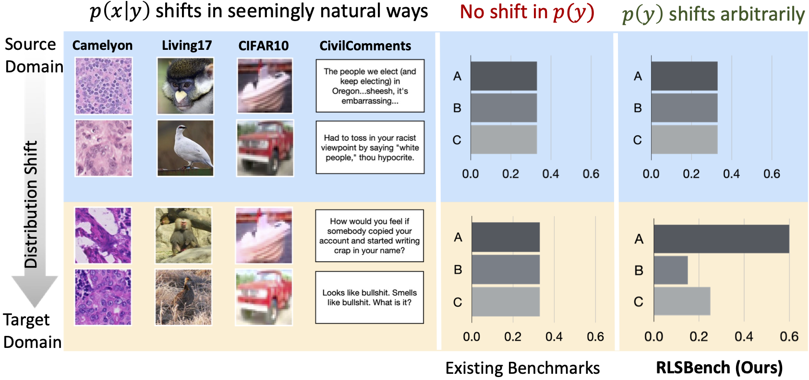

[](https://sites.google.com/view/rlsbench/)


`RLSbench` is the official implementation of [RLSbench: Domain Adaptation Under Relaxed Label Shift](https://arxiv.org/abs/2302.03020). We release the dataset setup, code and our logs/ models from our paper.


### Using the Dataset in an Academic Setting

To try more methods and experiments in our RLSbench setup with limited resources or for fast prototyping, we recommend restricting experiments to a few datasets with fewer label dist shift simulations. In particular, we observe that experiments on different domains in CIFAR10, Entity13, Living17, Visda and Retiring Adults datasets capture our main findings and the failure models. One can further restrict the simulated shifts to Dirichlet alpha in [None, 1.0 and 0.3] set. 


## Paper
For more details, refer to the accompanying paper: 
[RLSbench: Domain Adaptation Under Relaxed Label Shift](https://arxiv.org/abs/2302.03020). If you have questions, please feel free to reach us at sgarg2@andrew.cmu.edu or open an issue.  




If you find this repository useful or use this code in your research, please cite the following paper: 

> Garg, S., Erickson, N., Sharpnack, J., Smola, A., Balakrishnan, S., Lipton, Z. (2023). RLSbench: Domain Adaptation Under Relaxed Label Shift. arxiv preprint  arXiv:2302.03020. 
```
@article{garg2023RLSBench,
    title={RLSbench: Domain Adaptation Under Relaxed Label Shift},
    author={Garg, Saurabh and Erickson, Nick and Sharpnack, James and Smola, Alex and Balakrishnan, Sivaraman and Lipton, Zachary},
    year={2023}, 
    journal={arXiv preprint arXiv:2302.03020}
}
```

### Installation

To install `RLSbench`, run:
```python
pip install -e .
```

To install latest version of `RLSbench` as a package, run:

```python
pip install git+https://github.com/acmi-lab/RLSbench
```

## Datasets 


## Dataset Setup 
To setup different datasets, run the scrips in `dataset_scripts` folder. Except for Imagenet dataset which can be downloaded from the [official website](https://www.image-net.org/download.php), the scripts set up all the datasets (including all the source and target pairs) used in our study.

## Overview

Overall pipeline: 

The following are the crucial parts of the code:

1. `label_shift_utils.py`: This files contains utils functions to simulate label shift in the target data. 
2. `./datasets/get_dataset.py`: This file contains the code to get the source and target datasets.
3. `./algorithms/`: This folder contains the code for different algorithms. We implement the follwing domain algorithms:  
    - ERM variants: ERM, ERM-aug, with different pretraining techniques like ['rand', 'imagenet', 'clip', 'bert']
    - Domain alignment methods: DANN, CDAN, IW-DANN, IW-CDAN
    - Self-training methods: Noisy student, Pseudolabeling, FixMatch, SENTRY
    - Test time adaptation methods: BN_adapt, TENT,  CORAL 


The entry point of the code is `run_main.py`. `config` folder contains default parameters and hyperparameters needed for base experiments for the project. We need to pass the dataset name and the algorithm name with flag `--dataset` and `--algorithm` to the `run_main.py` file. To simulate label shift, we need to pass the flag `--simulate_label_shift` and the dirchilet sampling parameter with `--dirchilet_alpha`. And the flag `--root_dir` is used to specified the data directory for source and target datasets.

Caveat: For Test Time Adaptation (TTA) methods, we need to provide the folder with ERM-aug trained models with the parameter `--source_model_path`.

### Results Logging 
The code evaluates the models trained and logs the results in the `./logs/` folder in form of a csv file. 

## License
This repository is licensed under the terms of the [Apache License](LICENSE).

